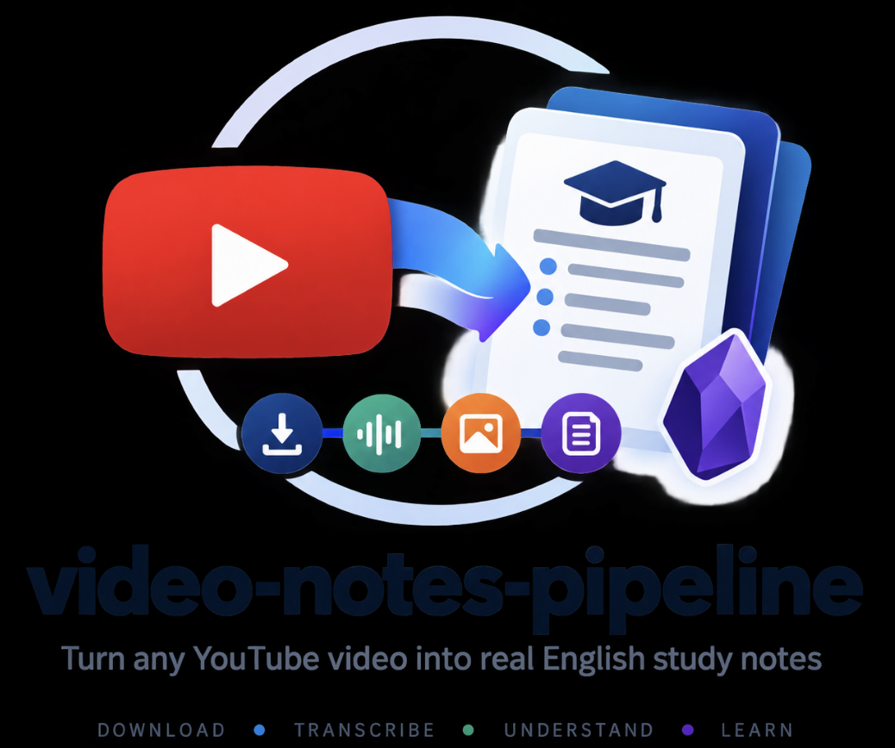

<p align="center">
  
</p>

# video-notes-pipeline

Turn any YouTube video, or an entire channel, into real English study notes using Claude Code skills end to end. No manual downloading, no manual transcription, no manual note-writing. Point it at a URL and get a note.

This is four Claude Code skills that chain together:

```
                  ┌─ YouTube captions
                  ├─ Whisper (independent pass)
YouTube Video ────┼─ On-screen text (OCR on frames)
                  ├─ Voice-activity check (from audio)
                  └─ Frames (Claude's own direct read, tiebreaker)
                        │
                        ▼
                 Cross-validation
                        │
                        ▼
                Reliable evidence          <- video-perceive stops here
                        │
                        ▼
                Video understanding        <- video-summary starts here
                        │
                        ▼
              Frozen knowledge model
                        │
                        ▼
              Structure-aware notes
                        │
                        ▼
                  Obsidian-ready           <- obsidian-md-formatter's syntax
```

`video-flow` is the one that runs this whole chain per video and keeps local disk usage flat no matter how many videos you run it over. You can also use `video-perceive` and `video-summary` directly and manage files yourself if you don't need that.

---

## Why this exists

Pasting a transcript into a chatbot and asking for "a summary" doesn't give you notes, it gives you a shorter transcript. It's often confidently wrong too, since YouTube's auto-captions mangle technical terms and names constantly, and the chatbot has no way to know that. Every tool built this way also hands back the same five bullet points no matter what you fed it, a tutorial, a debate, a 14-point comparison video, because it's compressing text, not understanding it.

| | Generic "summarize this video" | video-notes-pipeline |
|---|---|---|
| Transcript source | One transcript, trusted blindly | Captions, an independent Whisper pass, and on-screen OCR cross-checked against each other |
| A source disagrees | Picked silently, sometimes wrong | Flagged as uncertain in the note, never guessed |
| Output shape | Same bullet list, every video | Shaped by the video's own structure, tutorial vs. debate vs. listicle |
| How it writes | Compresses the transcript | Builds and freezes an actual understanding first, then writes from that |
| Storage cost | N/A | Stays flat no matter how many videos you run |

That first row isn't theoretical. Testing this pipeline surfaced real cases where two independent transcription engines produced the exact same wrong word, both fully confident, which is precisely the kind of error a plain "summarize the transcript" tool would never catch.

The last row exists because of a hard constraint: doing this properly means downloading the full video and running transcription locally, twice per segment for the cross-check, and that needs real disk space even if only temporarily. `video-flow` handles that by processing one video at a time in scratch space that gets wiped the moment its note is delivered, so local storage never actually grows.

## The four skills

### video-perceive (Layer 1: perception, not interpretation)

**The limitation it answers:** most video-summarizing tools just grab whatever transcript is easiest to get, usually YouTube's own auto-captions, and treat it as correct, even though auto-captions get names, numbers, and technical terms wrong all the time, and once that error is baked into "the transcript," nothing downstream ever gets a chance to catch it.

Turns a video into three first-class outputs and stops there: frames (deduped keyframes at scene changes), full audio, and a multi-source, cross-checked transcript. It doesn't summarize, judge, or write anything.

```
/video-perceive <video-or-playlist-or-channel-url>
```

Handles a single video, a playlist, or a whole channel. A playlist or channel resolves into one output subfolder per video, processed one at a time, with an `INDEX.txt` tracking status so one failed video doesn't stop the batch.

There's also a packaged single-video mode (`scripts/perceive_single.py`) that names the output folder from the video's own upload date and title, then strips it down to just what `video-summary` needs afterward. That's what `video-flow` uses under the hood for each video in a run.

No length limit. A 3-minute clip and a 40-hour recording get the same treatment: every scene change gets a frame, every second of audio gets transcribed by every available source, every segment gets the same cross-checking. Wall-clock time and token cost scale with length. Thoroughness doesn't.

### video-summary (Layer 2: understanding, then writing)

**The limitation it answers:** a "summarize this transcript" prompt just compresses text, it doesn't actually understand a video, so it can't tell an opinion apart from a fact, it flattens a contradiction the creator qualified later on, and it hands back the same generic bullet points whether the video was a tutorial, a debate, or a listicle, which isn't what a real learner's own notes ever look like.

Consumes a `video-perceive` output folder and produces the actual deliverable: a self-learner's own study notes, in clear English, as one complete pass. There's no "quick vs detailed" mode, just the full meaningful knowledge of the video.

```
/video-summary [folder] [terminal|md|html]
```

The rule this skill never breaks: understand the whole video first, freeze that understanding into a reconciled knowledge structure, then write the note from the frozen structure. It never writes and reasons at the same time, which is what stops a summary from quietly drifting away from what the video actually said.

Every note opens with a Quick Summary callout and a complete bulleted `## Summary` right after the metadata, so you get the gist in five seconds and the whole thing in one scroll, then the full detailed write-up follows below, shaped by the video's own structure: numbered lessons, a debate's two sides, a tutorial's steps, whatever the video itself does.

### obsidian-md-formatter (presentation syntax)

**The limitation it answers:** even a genuinely good AI-written note usually needs manual cleanup before it's actually usable, fixing headings, adding frontmatter, converting references into the vault's own link style, and that extra step is a real reason good notes quietly stop getting saved at all.

A small, always-on formatting layer: frontmatter, callouts, tables, footnotes, wiki-links, Mermaid diagrams, all written so any note this pipeline produces drops straight into an Obsidian vault with zero reformatting. `video-summary` loads this automatically when writing a note, and it's listed separately here because it's genuinely reusable for any markdown output, not just video notes.

### video-flow (the end-to-end orchestrator)

**The limitation it answers:** the depth `video-perceive` and `video-summary` deliver isn't free, downloading full videos and running local transcription needs real disk space even if only temporarily, and on a machine that's already short on storage that alone can make an otherwise-solid pipeline unusable in practice, which is exactly the tradeoff this skill exists to remove.

Chains `video-perceive` into `video-summary` for one video or a whole channel, and this is the point of the skill: it keeps nothing on disk except the final note. Each video gets processed inside a scratch working directory (a RAM disk on macOS by default, see Storage strategy below), and that whole working directory is deleted the moment the note is copied out, before the next video starts. Run it on a 10-video channel or a 1000-video channel and local disk usage stays flat either way.

```
/video-flow <video-or-channel-url> [--count N|all] [--format md|html] [--out dir] [--order oldest|newest] [--force] [--no-ramdisk]
```

It tracks what's already been processed in a `.video-flow-processed.log` next to the delivered notes, so running the same channel URL again later only picks up the new videos.

---

## Installation

1. Copy the `skills/` directory's four subfolders into your Claude Code skills directory:
   ```bash
   cp -r skills/* ~/.claude/skills/
   ```
2. Install the dependencies `video-perceive` needs. Nothing else in this pipeline needs anything beyond Python's standard library.

   | Dependency | Needed for | Required? |
   |---|---|---|
   | [`yt-dlp`](https://github.com/yt-dlp/yt-dlp) | downloading video/audio, fetching captions and metadata | required for any URL source |
   | `ffmpeg` + `ffprobe` | frame extraction, audio extraction | required |
   | One local Whisper engine: [`mlx-whisper`](https://github.com/ml-explore/mlx-examples) (Apple Silicon), [`openai-whisper`](https://github.com/openai/whisper), or `whisper.cpp` | transcribing videos with no existing captions, and cross-checking captions that do exist | required unless every video you process already has captions |
   | `torch` + `torchaudio` | Silero voice-activity detection, a cross-check signal | optional, pipeline still runs without it with one less signal |
   | `tesseract` | on-screen-text OCR, another cross-check signal | optional, pipeline still runs without it |

   Check what's actually available on your machine:
   ```bash
   python3 ~/.claude/skills/video-perceive/scripts/setup.py
   ```
3. That's it. No config files and no API keys, everything runs locally, and Whisper transcription never leaves your machine.

## Quick start

```
# One video, notes printed straight into the chat
/video-summary
# (after first running /video-perceive <url> in the same directory)

# One video, saved as a flat .md file, nothing else left on disk
/video-flow https://www.youtube.com/watch?v=VIDEO_ID

# The next 5 not-yet-processed videos from a channel, as .md
/video-flow https://www.youtube.com/@channel --count 5

# A whole channel, oldest videos first, as .html
/video-flow https://www.youtube.com/@channel --count all --order oldest --format html
```

## Storage strategy

Long videos and Whisper transcription can use real disk space temporarily while a video is being processed, mainly the source download and the extracted audio, even though the final kept output (frames, transcript, the note) is small. `video-flow` handles this by processing each video inside a scratch working directory that gets deleted the moment its note is delivered, so nothing accumulates no matter how long a run goes. On macOS this scratch space is a RAM disk by default, the fastest option and one where nothing touches the real disk during processing at all, but it's an optimization, not a requirement:

- **RAM disk (macOS, default).** Auto-sized to a safe fraction of available RAM, created and torn down automatically per run. Falls back on its own if creation fails for any reason, not enough free RAM, `diskutil`/`hdiutil` unavailable, whatever it is.
- **Plain temp directory (any OS, or `--no-ramdisk`).** Same per-video cleanup discipline, just on the real disk instead of RAM. Storage safety comes from the cleanup, not from which kind of scratch space is used, so this is a completely valid choice on a machine with little free RAM, or on Linux/Windows where the RAM disk path doesn't apply.
- **Your own external or network drive.** Nothing here requires the working directory to sit on the machine's main volume. Pointing `--out` (where `video-flow` delivers notes) or the folder you `cd` into before running `video-perceive`/`video-summary` manually at an external drive works the same way, if that fits your setup better.
- **Skip `video-flow` entirely.** If storage isn't actually a constraint for you, `video-perceive` and `video-summary` can be run directly with a normal output folder. You keep the full Layer 1 evidence (frames, transcript) around for as many videos as you like, which also makes re-rendering a note in a different format free, no re-download and no re-transcription needed.

Pick whichever of these actually fits your machine and habits. None of them is "the" correct way to use this pipeline.

## Notes on customizing

- **Output language.** Notes are written in clear English by design (`video-summary/reference/templates.md`). If you want a different language or a bilingual mix, that file is where the language rule lives, and it's the only place it needs to change.
- **Note voice and structure.** The same file also defines the self-learner voice and the "mirror the video's own structure" rule. Adjust it if you want a different kind of note, more clinical, less beginner-oriented, whatever fits.
- **Frame and transcription quality vs. speed.** `video-perceive`'s `watch.py` exposes flags for scene-change sensitivity, frame resolution, and a `--fast` single-pass transcription mode. See `video-perceive/SKILL.md`.

## License

`video-perceive` is marked MIT in its own frontmatter. Apply whatever license you'd like to the rest of the repo.
