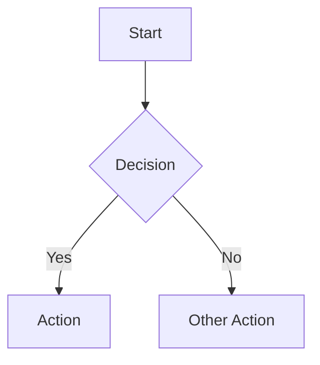

# Obsidian Syntax — Full Reference

This file is `SKILL.md`'s detailed backup. Only open it when the quick cheatsheet
doesn't have the answer.

## Table of Contents

1. [Headings](#1-headings)
2. [Text Formatting](#2-text-formatting)
3. [Lists](#3-lists)
4. [Blockquotes](#4-blockquotes)
5. [Horizontal Rule](#5-horizontal-rule)
6. [Code Blocks](#6-code-blocks)
7. [Tables](#7-tables)
8. [Wiki Links](#8-wiki-links)
9. [Embeds](#9-embeds)
10. [Block IDs](#10-block-ids)
11. [Comments](#11-comments)
12. [Callouts — Full List](#12-callouts--full-list)
13. [Math / LaTeX](#13-math--latex)
14. [Mermaid Diagrams](#14-mermaid-diagrams)
15. [Frontmatter / Properties](#15-frontmatter--properties)
16. [Dataview Queries](#16-dataview-queries)
17. [Footnotes](#17-footnotes)
18. [Tags](#18-tags)
19. [External Links & References](#19-external-links--references)
20. [Media Embeds](#20-media-embeds)
21. [Aliases](#21-aliases)

---

## 1. Headings

```markdown
# H1
## H2
### H3
#### H4
##### H5
###### H6
```
Only **one** H1 per note (the title). Everything below it nests as H2/H3.

## 2. Text Formatting

```markdown
**bold**
__bold (alt)__
*italic*
_italic (alt)_
***bold italic***
~~strikethrough~~
`inline code`
```

## 3. Lists

```markdown
- Unordered item
  - Nested item

1. Ordered item
   1. Nested ordered item

- [ ] Incomplete task
- [x] Completed task
```

## 4. Blockquotes

```markdown
> Single line quote
>
> Multi-paragraph quote
```

## 5. Horizontal Rule

```markdown
---
***
___
```
All three are equivalent — `---` is the most commonly used.

## 6. Code Blocks

````markdown
```python
def hello():
    print("Hello")
```

```bash
nmap -sV target.com
```
````
**Always** give a language tag — for security payloads/commands too (`bash`, `python`, `http`, `json`, etc.)

## 7. Tables

```markdown
| Header 1 | Header 2 |
|----------|----------|
| Cell 1   | Cell 2   |
```

## 8. Wiki Links

```markdown
[[Note Name]]
[[Note Name|Display Text]]
[[Note Name#Heading]]
[[Note Name#Heading|Custom Text]]
[[Note Name#^block-id]]
[[Folder/Subfolder/Note Name]]
```

## 9. Embeds

```markdown
![[Note Name]]                 (embed full note)
![[Note Name#Heading]]         (embed a heading section)
![[Note Name#^block-id]]       (embed a specific block)
```

## 10. Block IDs

```markdown
Some text here ^block-id-name

- List item ^list-item-id
```
To reference it: `[[Note Name#^block-id]]`

## 11. Comments

```markdown
%%
This is a comment, invisible in preview
%%

Inline: text %%comment%% and text
```

## 12. Callouts — Full List

Syntax:
```markdown
> [!type] Optional custom title
> Content goes here
```

Collapsible:
```markdown
> [!note]-   (collapsed by default)
> [!note]+   (expanded by default)
```

Nested:
```markdown
> [!note]
> Outer
> > [!warning]
> > Inner nested
```

**Available types (aliases in brackets):**

| Type | Aliases |
|---|---|
| `note` | — |
| `abstract` | `summary`, `tldr` |
| `info` | — |
| `todo` | — |
| `tip` | `hint`, `important` |
| `success` | `check`, `done` |
| `question` | `help`, `faq` |
| `warning` | `caution`, `attention` |
| `failure` | `fail`, `missing` |
| `danger` | `error`, `bug` |
| `example` | — |
| `quote` | `cite` |

## 13. Math / LaTeX

```markdown
Inline: $E = mc^2$

Block:
$$
E = mc^2
$$

Complex:
$$
\begin{align}
x &= 1 \\
y &= 2
\end{align}
$$
```

## 14. Mermaid Diagrams

````markdown

````

**Types available:** `flowchart`, `sequenceDiagram`, `classDiagram`, `stateDiagram-v2`, `erDiagram`, `gantt`, `pie`, `graph LR/TD`.

Use case guide:
- Attack flow / process → `flowchart`
- Request-response interaction → `sequenceDiagram`
- System states (e.g. auth session states) → `stateDiagram-v2`
- Data relationships → `erDiagram`
- Timeline/project plan → `gantt`
- Proportions → `pie`

## 15. Frontmatter / Properties

```yaml
---
title: Note Title
date: 2024-01-01
tags: [tag1, tag2]
aliases: [alt-name]
status: active
---
```
Inline properties (core plugin): `key:: value` also works inside body text.

## 16. Dataview Queries

````markdown
```dataview
TABLE title, status
FROM "Folder"
WHERE status = "active"
```

```dataview
LIST
FROM "Projects"
WHERE completed = false
```

```dataview
TASK
FROM "Tasks"
WHERE !completed
```
````
Only use this when the query is genuinely pulling vault-wide data — no need to
add a dataview block inside a single, standalone note.

## 17. Footnotes

```markdown
Claim goes here[^1]

[^1]: Explanation or source
```

Inline variant:
```markdown
Claim goes here[^inline note text]

[^inline note text]: Content
```

## 18. Tags

```markdown
#tag
#nested/tag
#tag-with-dash

Inline: text #inline-tag text
```
In YAML: `tags: [tag1, nested/tag]`

## 19. External Links & References

```markdown
[Link Text](https://example.com)
[Link Text](https://example.com "Hover Title")
https://example.com   (autolink)
[Link](../other-folder/note.md)   (relative file link)
[Link](#heading-name)   (fragment link)
```

## 20. Media Embeds

```markdown
![[image.png]]
![[image.png|300]]        (width specify)
![[document.pdf]]
![[document.pdf#page=3]]  (specific page)
![[audio.mp3]]
![[video.mp4]]
```

## 21. Aliases

```yaml
---
aliases: [alias1, alias2, "multi word alias"]
---
```
Link via alias: `[[Note Name|Alias Name]]`
